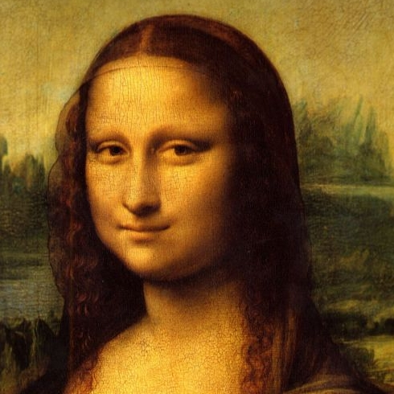

# FisheyePanoramaStitch

**[English](docs/ReadmeEn.md) | [Chinese](README.md)**

- 一份使用python实现的鱼眼相机全景图像拼接以及OpenGL显示的Demo

- **参考仓库: [fisheyeStitcher](https://github.com/drNoob13/fisheyeStitcher.git)**

## 环境安装

- 代码clone：

```
git clone https://github.com/JokerEyeAdas/FisheyePanoramaStitch.git
```

- python依赖：
```
pip install -r requirements.txt
```
`我这个环境是conda默认的，包有点大，所以你们可以仅安装必要的即可`

## 代码说明

|File|Usage|
|----|----|
|[MLS.py](MLS.py)|移动最小二乘法实现，用于标定图像|
|[FisheyeSticth.py](FisheyeSticth.py)| 鱼眼unwarp以及拼接实现|
|[PanoramaViewer.py](PanoramaViewer.py)| 使用OpenGL进行纹理映射显示全景图的Demo|

## 运行

- 全景拼接
  
```
python3 FisheyeSticth.py
```
软件自动读取图像以及标定数据并生成全景图像，并显示2D图像

- 蒙娜丽莎MLS变换demo(用户需要输入自己的标定点)
```
python3 MLS.py
```

|原始图|mls变换图|
|-----|---|
|||
- 全景显示
```
python3 PanoramaViewer.py
```
软件自动读取output目录下的全景图像并显示3D图像


