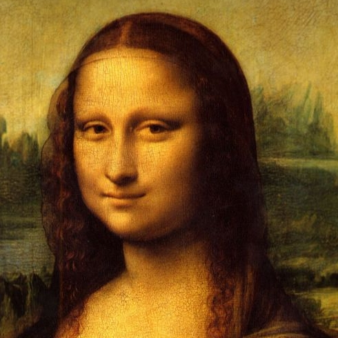
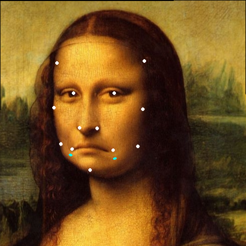

# FisheyePanoramaStitch

**[English](ReadmeEn.md) | [Chinese](../README.md)**

- A demo of fisheye camera panoramic image stitching and OpenGL display implemented using Python

- **Reference Repo [fisheyeStitcher](https://github.com/drNoob13/fisheyeStitcher.git)**

## Python Requirements

- repo clone：

```
git clone https://github.com/JokerEyeAdas/FisheyePanoramaStitch.git
```

- python environment install：
```
pip install -r requirements.txt
```
`My environment is the default for conda, and the package is a bit large, so you can only install the necessary ones`

## Code File Info

|File|Usage|
|----|----|
|[MLS.py](../MLS.py)|移动最小二乘法实现，用于标定图像|
|[FisheyeSticth.py](../FisheyeSticth.py)| 鱼眼unwarp以及拼接实现|
|[PanoramaViewer.py](../PanoramaViewer.py)| 使用OpenGL进行纹理映射显示全景图的Demo|

## Run Demo

- Fisheye Sticth
  
```
python3 FisheyeSticth.py
```
The software automatically reads images and calibration data, generates panoramic images, and displays 2D images

- Mona Lisa MLS Transformation Demo (Users need to input their own calibration points)
```
python3 MLS.py
```

|origin|after mls|
|-----|---|
|||
- OpenGl Show
```
python3 PanoramaViewer.py
```
The software automatically reads panoramic images from the output directory and displays 3D images


